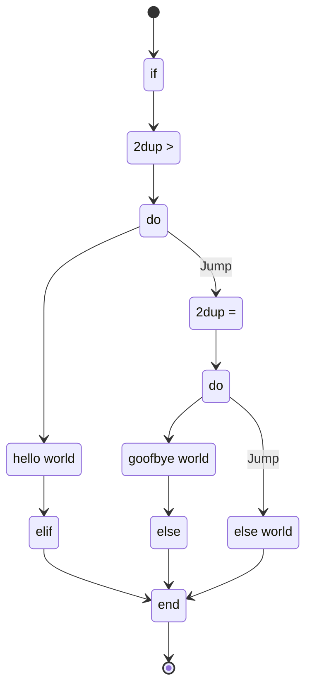
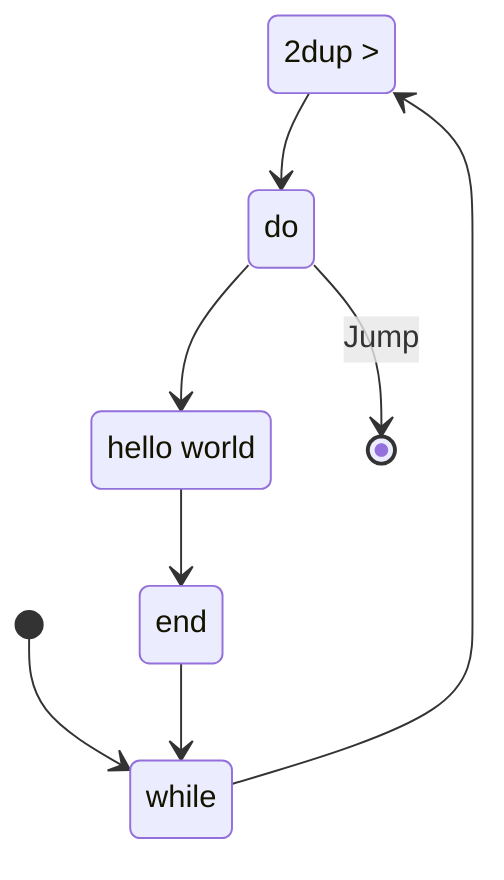
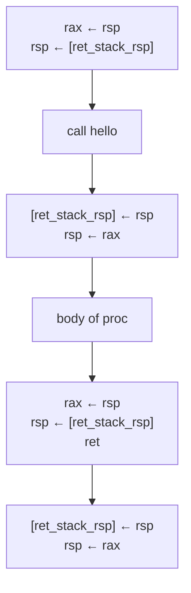

# Control flow in goof

## if elif else

```pascal
5 0
if 2dup > do
    "hello world" puts
elif 2dup = do
    "goofbye world" puts
else
    "else world" puts
end
```



## Loops

```pascal
5 0
while 2dup > do
    "hello world" puts
    1 +
end
```



## Procedures

```assembly
global _start
_start:
    mov [args_ptr], rsp
    mov rax, ret_stack_end
    mov [ret_stack_rsp], rax
addr_0:
    ;; -- skip proc --
    jmp addr_14
hello:
    ;; -- prep proc --
    mov [ret_stack_rsp], rsp
    mov rsp, rax
addr_2:
addr_3:
addr_4:
addr_5:
    ;; -- push str hello world --
    mov rax, 11
    push rax
    push str_0
addr_6:
    ;; -- push int 1 --
    mov rax, 1
    push rax
addr_7:
    ;; -- push int 1 --
    mov rax, 1
    push rax
addr_8:
    ;; -- syscall --
    pop rax
    pop rdi
    pop rsi
    pop rdx
    syscall
    push rax
addr_9:
    ;; -- drop --
    pop rax
addr_10:
    ;; -- push int 1 --
    mov rax, 1
    push rax
addr_11:
    ;; -- ret --
    mov rax, rsp
    mov rsp, [ret_stack_rsp]
    ret
addr_12:
    ;; -- ret --
    mov rax, rsp
    mov rsp, [ret_stack_rsp]
    ret
addr_13:
    ;; -- end --
addr_14:
    ;; -- call hello --
    mov rax, rsp
    mov rsp, [ret_stack_rsp]
    call hello
    mov [ret_stack_rsp], rsp
    mov rsp, rax
addr_15:
    ;; -- drop --
    pop rax
addr_16:
    mov rax, 60
    mov rdi, 0
    syscall
segment .data
str_0: db 0x68,0x65,0x6c,0x6c,0x6f,0x20,0x77,0x6f,0x72,0x6c,0x64
segment .bss
args_ptr: resq 1
ret_stack_rsp: resq 1
ret_stack: resb 4096
ret_stack_end: resq 1
mem: resb 640000
```


