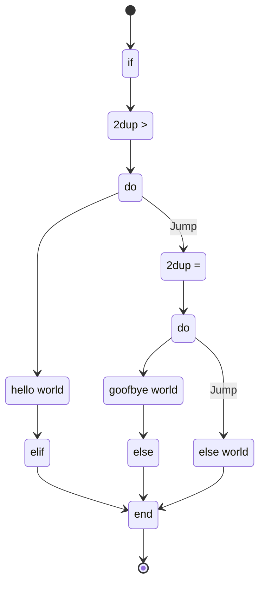
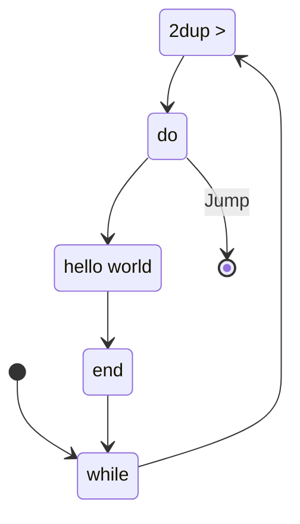

# Control flow in goof

## if elif else

```pascal
5 0
if 2dup > do
    "hello world" puts
elif 2dup = do
    "goofbye world" puts
else
    "else world" puts
end
```



## Loops

```pascal
5 0
while 2dup > do
    "hello world" puts
    1 +
end
```



