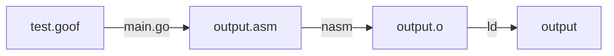

# G00F

> I wanted to talk to the computer using my own language

goof or goForth: a stack-based concatenative programming language inspired by [Forth](https://en.wikipedia.org/wiki/Forth_(programming_language)) and implemented in Go.

I made this contraption to learn more about compilers and computer architecture.
I did not use [LLVM](https://llvm.org/), and kept the target machine `x86_64` for this language since I wanted to get insights into the compilation process (and hopefully learn some non-trivial aspects about binaries).

## Idea

I always wanted a self hosted compiler for my own language. The big picture is to build a simple computer catered for the langauge.
The idea for this project stemmed from [Crafting Interpreters](https://www.craftinginterpreters.com/). But I believe the book spoon feeds the concepts and at the end you have an emulator program for running your language and not a native program that you can call independent. Hence bootstrapping through this route would have been very difficult.
Majority of the project has been inspired from [tsoding](https://www.youtube.com/@TsodingDaily) and his [porth](https://www.youtube.com/playlist?list=PLpM-Dvs8t0VbMZA7wW9aR3EtBqe2kinu4) series which is a language like Forth but in python. I decided to write this in go for various reasons I find meaningful.

## Usage

You would require the following for compiling the language to a 64 bit ELF executable file.
- [go](https://go.dev/)
- [nasm](https://nasm.us/): Netwide Assembler is being used to generate the object file for `x86_64` architecture after translating the language to assembly.
- [ld](https://linux.die.net/man/1/ld): For linking the generated object file to final ELF executable.

The following flowchart summarizes the workflow



For compiling the program written in `test.goof` and writing to an ELF executable `output` (you can check the generated assembly in `output.asm`)
```shell
go run main.go com ./test.goof
./output
```

The compiled binary can be verified using `file` and `ldd` commands.
```shell
$ file output
output: ELF 64-bit LSB executable, x86-64, version 1 (SYSV), statically linked, not stripped

$ ldd output
	not a dynamic executable
```

## TODOs
- [x] Compiled
- [x] Native
- [x] Turing complete
- [x] Static type checking, check reference [here](https://binji.github.io/posts/webassembly-type-checking/)
- [x] Add editor config for vim and nvim for goof source files
- [ ] Deploy a static site with an online playground for compiling on the go
    - [ ] investigate and use goroutine for this
- [ ] Include directories and add support for finding included files
- [ ] Self-hosted compiler
    - [x] support extracting command line args
    - [ ] memory mapping file contents for self hosting parsing [ref](https://man7.org/linux/man-pages/man2/mmap.2.html)
- [ ] Add support for defining and calling functions with params
- [ ] Add library builtin functions

## BUGS
- [ ] dump operation only prints unsigned integers

## Language Reference

The language implements the following constructs

### Literals

#### Integer

Currently a sequence of digits which may optionally start with a dash (-) is interpreted as an integer.

```pascal
10 1 +
```

The code above pushes 10 and 1 to the stack, pop them, sums them up and then pushes the result on top of stack.

#### String

A string is a sequence of characters sandwiched between double quotes (").

```pascal
include "std.goof"

"Hello World\n" stdout write
```

When the compiler encounters a string the following happens:
1. the size of the string in bytes is pushed onto the stack,
2. the bytes of the string are copied somewhere into the memory,
3. the pointer to the beginning of the string is pushed onto the data stack.

### Intrinsics

#### stack

| Name    | Signature        | Description                                                                                 |
| ---     | ---              | ---                                                                                         |
| `dup`   | `a -- a a`       | duplicate an element on top of the stack                                                    |
| `swap`  | `a b -- b a`     | swap 2 elements on the top of the stack                                                     |
| `drop`  | `a b -- a`       | drops the top element of the stack                                                          |
| `dump`  | `a b -- a`       | print the element on top of the stack in a free form to stdout and remove it from the stack |
| `over`  | `a b -- a b a`   | copy the element below the top of the stack                                                 |
| `rot`   | `a b c -- b c a` | rotate the top three stack elements                                                         |

#### Comparison

| Name | Signature                              | Description                                            |
| ---  | ---                                    | ---                                                    |
| `=`  | `[a: int] [b: int] -- [a == b : bool]` | checks if two elements on top of the stack are equal   |
| `!=` | `[a: int] [b: int] -- [a != b : bool]` | checks if two elements on top of the stack are unequal |
| `>`  | `[a: int] [b: int] -- [a > b  : bool]` | applies the greater comparison on top two elements     |
| `<`  | `[a: int] [b: int] -- [a < b  : bool]` | applies the less comparison on top two elements        |

#### Arithmetic

| Name     | Signature                                        | Description                                                                 |
| ---      | ---                                              | ---                                                                         |
| `+`      | `[a: int] [b: int] -- [a + b: int]`              | sums up two elements on the top of the stack                                |
| `-`      | `[a: int] [b: int] -- [a - b: int]`              | subtracts two elements on the top of the stack                              |
| `*`      | `[a: int] [b: int] -- [a * b: int]`              | multiplies two elements on the top of the stack                             |
| `divmod` | `[a: int] [b: int] -- [a / b: int] [a % b: int]` | divides two elements on the top of the stack, pushes quotient and remainder |

#### Bitwise

| Name  | Signature                            | Description                  |
| ---   | ---                                  | ---                          |
| `shr` | `[a: int] [b: int] -- [a >> b: int]` | right **unsigned** bit shift |
| `shl` | `[a: int] [b: int] -- [a << b: int]` | left bit shift               |
| `or`  | `[a: int] [b: int] -- [a \| b: int]` | bit `or`                     |
| `and` | `[a: int] [b: int] -- [a & b: int]`  | bit `and`                    |

#### Memory

- `mem` - pushes the memory address on the stack
```pascal
push(mem)
```

- `,` - **load**: pops the memory address from stack and pushes the value present at that address (dereferences the memory address present on top of stack)
```pascal
mem = pop()
value = get_value_at_address(mem)
push(value)
```

- `.` - **store**: pops the value from stack, pops memory address from stack and stores the value at that address
```pascal
value = pop()
mem = pop()
set_value_at_address(mem, value)
```

#### System

- `syscall<n>` - perform a syscall with n arguments where n is in range `[0..6]`. (`syscall1`, `syscall2`, etc)

```porth
syscall_number = pop()
<move syscall_number to the corresponding register>
for i in range(n):
    arg = pop()
    <move arg to i-th register according to the call convention>
<perform the syscall>
```

- `include` - includes the tokens from a goof file into the current file.
