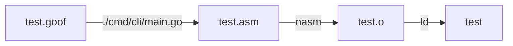

# G00F

> I wanted to talk to the computer using my own language

goof or goForth: a stack-based concatenative programming language inspired by [Forth](https://en.wikipedia.org/wiki/Forth_(programming_language)) and implemented in Go.

I made this contraption to learn more about compilers and computer architecture.
I did not use [LLVM](https://llvm.org/), and kept the target machine `x86_64` linux for this language since I wanted to get insights into the compilation process (and hopefully learn some non-trivial aspects about binaries).

Table of Contents
1. [Idea](#idea)
2. [Usage](#usage)
3. [Example](#example)
4. [TODOs](#todos)
5. [Bugs](#bugs)
6. [Language Reference](#language-reference)

## Idea

I always wanted a self hosted compiler for my own language. The big picture is to build a simple computer catered for the langauge.
The idea for this project stemmed from [Crafting Interpreters](https://www.craftinginterpreters.com/). But I believe the book spoon feeds the concepts and at the end you have an emulator program for running your language and not a native program that you can call independent. Hence bootstrapping through this route would have been very difficult.
Majority of the project has been inspired from [tsoding](https://www.youtube.com/@TsodingDaily) and his [porth](https://www.youtube.com/playlist?list=PLpM-Dvs8t0VbMZA7wW9aR3EtBqe2kinu4) series which is a language like Forth but in python. I decided to write this in go for various reasons I find meaningful.

## Usage

You would require the following for compiling the language to a 64 bit ELF executable file.
- [go](https://go.dev/): at the time of writing, I have used `1.23.3` version
- [nasm](https://nasm.us/): Netwide Assembler is being used to generate the object file for `x86_64` architecture by taking the assembly as input.
- [ld](https://linux.die.net/man/1/ld): For linking the generated object file to final ELF executable.

The following flowchart summarizes the workflow



## Example

Write the following program in `test.goof`
```pascal
20 22 + dump
```

For compiling the program written in `test.goof` and writing to an ELF executable `test` (you can check the generated assembly in `test.asm`).
```shell
$ go run ./cmd/cli ./test.goof
$ ./test
42
```
Currently this ELF executable can only be run on linux 64 bit systems (`x86_64` architecture)

The compiled binary can be verified using `file` and `ldd` commands.
```shell
$ file test
test: ELF 64-bit LSB executable, x86-64, version 1 (SYSV), statically linked, not stripped

$ ldd test
	not a dynamic executable
```

Other examples can be found in [/examples](./examples) directory which can be readily compiled.

## TODOs
- [x] Compiled
- [x] Native
- [x] Turing complete
- [x] Static type checking, check reference [here](https://binji.github.io/posts/webassembly-type-checking/)
- [x] Add editor config for vim / nvim for goof source files, check [vim.goof](./editor/vim.goof)
- [x] Add local memory
- [ ] Add procedures with parameters and return values
    - [x] add type signatures
    - [ ] add type checking inside function (context stack)
    - [ ] add local memory and clean function stack after return, check [ref](https://forum.nasm.us/index.php?topic=1611.0)
- [ ] Deprecate macros
    - [ ] add offset keyword for defining memory offsets for structs
- [ ] Use goroutines for lexical scanning check [ref](https://www.youtube.com/watch?v=HxaD_trXwRE)
- [ ] Self-hosted compiler
    - [x] support extracting command line args, check [cli-args.goof](./tests/cli-args.goof)
    - [x] memory mapping file contents for self hosting parsing, check [ref](https://man7.org/linux/man-pages/man2/mmap.2.html), check [file-map.goof](./examples/file-map.goof)
    - [x] add support for parsing strings, say string.goof, check [ref](https://github.com/tsoding/sv), check [string.goof](./string.goof)
    - [x] parse goof file into operations instead of hardcoding the program
    - [ ] run exec system call to execute nasm and ld, for producing final binary
- [ ] Deploy a static site with an online playground for compiling on the go
- [ ] Include directories and add support for finding included files
- [ ] Add library builtin functions

## BUGS
- [ ] dump operation only prints unsigned integers
- [ ] elif branches in if construction might produce different arguments on stack
- [ ] proc assembly produces two return instructions (if a ret is followed by end of proc)

## Language Reference

The language implements the following *goofy* constructs

### Literals

#### Integer

Currently a sequence of digits which may optionally start with a dash (-) is interpreted as an integer.

```pascal
10 1 +
```

The code above pushes 10 and 1 to the stack, `+` operator pops them, sums them up and then pushes the result (11) on top of stack.

#### String

A string is a sequence of characters sandwiched between double quotes (").

```pascal
include "std.goof"

"Hello World\n" stdout write
```

When the compiler encounters a string the following happens:
1. the size of the string in bytes is pushed onto the stack,
2. the bytes of the string are copied somewhere into the memory,
3. the pointer to the beginning of the string is pushed onto the data stack.

### Intrinsics

#### stack

| Name    | Signature        | Description                                                                                 |
| ---     | ---              | ---                                                                                         |
| `dup`   | `a -- a a`       | duplicate an element on top of the stack                                                    |
| `swap`  | `a b -- b a`     | swap 2 elements on the top of the stack                                                     |
| `drop`  | `a b -- a`       | drops the top element of the stack                                                          |
| `dump`  | `a b -- a`       | print the element on top of the stack, remove it from the stack (element is treated as unsigned 64bit int) |
| `over`  | `a b -- a b a`   | copy the element below the top of the stack                                                 |
| `rot`   | `a b c -- c a b` | rotate the top three stack elements                                                         |

#### Comparison

| Name | Signature                              | Description                                            |
| ---  | ---                                    | ---                                                    |
| `=`  | `[a: int] [b: int] -- [a == b : bool]` | checks if two elements on top of the stack are equal   |
| `!=` | `[a: int] [b: int] -- [a != b : bool]` | checks if two elements on top of the stack are unequal |
| `>`  | `[a: int] [b: int] -- [a > b  : bool]` | applies the greater comparison on top two elements     |
| `<`  | `[a: int] [b: int] -- [a < b  : bool]` | applies the less comparison on top two elements        |

#### Arithmetic

| Name     | Signature                                        | Description                                                                 |
| ---      | ---                                              | ---                                                                         |
| `+`      | `[a: int] [b: int] -- [a + b: int]`              | sums up two elements on the top of the stack                                |
| `-`      | `[a: int] [b: int] -- [a - b: int]`              | subtracts two elements on the top of the stack                              |
| `*`      | `[a: int] [b: int] -- [a * b: int]`              | multiplies two elements on the top of the stack                             |
| `divmod` | `[a: int] [b: int] -- [a / b: int] [a % b: int]` | divides two elements on the top of the stack, pushes quotient and remainder |

#### Bitwise

| Name  | Signature                            | Description                  |
| ---   | ---                                  | ---                          |
| `shr` | `[a: int] [b: int] -- [a >> b: int]` | right **unsigned** bit shift |
| `shl` | `[a: int] [b: int] -- [a << b: int]` | left bit shift               |
| `or`  | `[a: int] [b: int] -- [a \| b: int]` | bitwise `or`                 |
| `and` | `[a: int] [b: int] -- [a & b: int]`  | bitwise `and`                |

#### Control flow

- `if`, `elif`, `else` can be used to execute conditional flows as follows:
- `if` and `elif` are used in combination with `do` which expects a boolean value on stack
```pascal
// if boolCondition do
// ...
// end
42
41
if 2dup > do   // will check if 42 > 41
    1 dump
elif 2dup = do // will check if 42 == 41
    0 dump
else           // this runs after all branches are false
    2 dump
end
```

#### Loops

- classic while loops are supported with `while` keyword
- `while` is used in combination with `do` which expects a boolean value
```pascal
// while boolCondition do
// ...
// end
0                // iteration count i
while dup 5 < do // will check if i < 5
    0 dump       // body of while
    1 +          // i = i + 1
end
```

#### Memory

- `mem` - pushes the memory address on the stack

- `memory` - allocates a defined size of memory to a pointer which can be used as a label
```pascal
memory num 8 end
// num = malloc(8)
```

- `.` - **store**: pops the value from stack, pops memory address from stack and stores the value at that address
```pascal
num 42 .
// mem[num] = 42
```

- `.64` - **store64**: stores 64 bit integer instead of 8 bit

- `,` - **load**: pops the memory address from stack and pushes the value present at that address (dereferences the memory address present on top of stack)
```pascal
42 num ,
// push(mem[num])
```

- `,64` - **load64**: loads 64 bit integer instead of 8 bit

#### Procedures

- `proc` keyword is used to make a procedure with type signatures
- `proc` is followed by the name of procedure
- which is then followed by type signatures of paramaters and return (separated by `--`)
- `proc abc int -- int --` defines function named `abc` which takes an `int` as paramter and returns `int`
- general procedure definition goes like this- `proc procName <inputs> -- <outputs> -- <body> end`
```pascal
proc hello -- int -- // no parameters but returns int
    "Hello " 1 1 syscall3 drop // print "Hello" on console using write syscall
    1 ret // return 1
end
// call the proc like this
hello dump // dump the int return from procedure
```

#### System

- `syscall<n>` - perform a syscall with n arguments where n is in range `[0..6]`. (`syscall1`, `syscall2`, etc)

```c
syscall_number = pop()
<move syscall_number to the corresponding register>
for (int i=0; i<n; i++) {
     arg = pop()
     <move arg to i-th register according to the call convention>
}
<perform the syscall>
```

- `include` - includes the tokens from a goof file into the current file.
